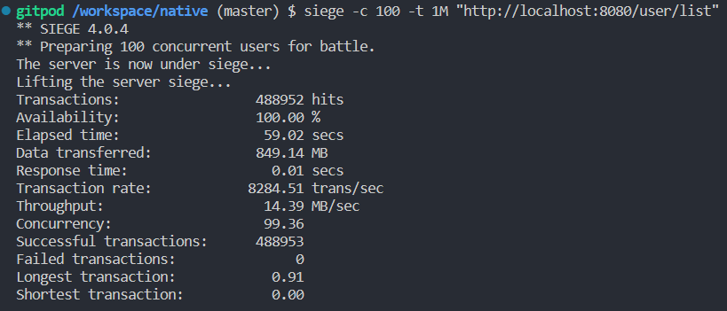
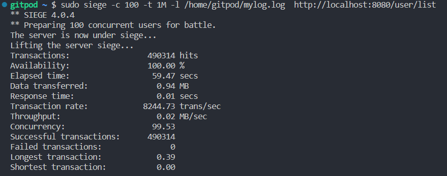

# native
1. 编译成native
```
  ./mvnw -Pnative native:compile
```

2. 尽可能的 `static`
```
  ./mvnw -Pnative native:compile -DbuildArgs=-H:+StaticExecutableWithDynamicLibC
```

3. 性能对比

| 对比项 | jar | native |
| :---   | :---:    | :---:   |
|  编译速度 |  3s   | 3m2s |
|  大小 | 41M + JRE    | 133M(47M)  |
| 启动速度  | 3.234s    |  0.109 |
| 内存占用(空闲)  | 284M    | 150M  |
| 内存占用(满负载)  | 600M+(800M+)    | 200M+(300M+)  |

4. 压力测试 详情

```
siege -c 100 -t 1M "http://localhost:8080/user/list"
```

java -jar 启动:



native 启动:


